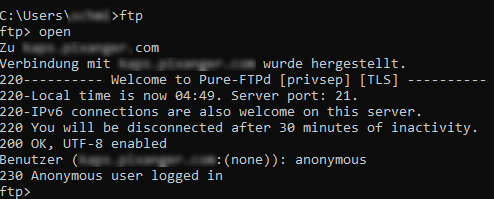

# photoplatform2020

## Background

In early 2020 I was looking through some pictures at the website of a local photographer. Apart from common shootings the company also took pictures of the graduation ceremonies at my former university. Most photo albums at that website were secured by a password, and I got a valid password from my university to view the pictures of my graduation.
After entering the password I was able to see all pictures of the album in a gallery view, or to see a single picture within a single-photo view. 

## Vulnerability Description

When browsing through all the photos I noticed that there are some GET-parameters in the URL.

### gallery view
The **gallery view url** had the following scheme:
<pre>www.[URLofVulnWebsite].de/index.php?nav=showgrp&<b>subcat=[AlbumID]</b>&HC=1000</pre>
- The parameter **subcat=[AlbumID]** is a three or four digit number, which is used to access a specific album.
  
### single-photo view
The single-photo view url had the following scheme:
<pre>www.[URLofVulnWebsite].de/includes/thumb.php?<b>iid=[ImageID]</b>&<b>eid=[AlbumID]</b>&<b>maxwidth=[Width]</b></pre>
- The parameter **eid=[AlbumID]** is used as explained above.
- The parameter **iid=[ImageID]** defines which image of the current album is shown.
- The parameter **maxwidth=[Width]** determines the width of the displayed image. Usually the default parameter was set to 500, which led to a downscaling of the image. But by increasing this number to an arbitrary value larger than the width of the original file, the original file is displayed with best quality.

I tried out to manipulate those parameters. Thus I found out I not only was able to access all the pictures of my graduation, but also get hold of any image in any album at the server with a direct url (even it was protected with an unknown password). This vulnerability can be classified as [Broken Access Control](https://owasp.org/www-community/Broken_Access_Control) which could be attacked by [Forced Browsing](https://owasp.org/www-community/attacks/Forced_browsing).

## Exploitation Examples

For example it would have been possible to access the gallery view of the album with the ID : 8330
<pre>www.[URLofVulnWebsite].de/index.php?nav=showgrp&subcat=8330&HC=1000</pre>

The access of the 1st image of this album, with a width of 2000px, would have been possible with the following ID:
<pre>www.[URLofVulnWebsite].de/includes/thumb.php?iid=1&eid=8330&maxwidth=2000</pre>

To make the company aware of the severity I wrote an exploit. This could have been used to download a given number of photos of each album (within an AlbumID range), with an arbitrary width. As the website is not available anymore I  it for educational purposes.

## Additional Remarks
The server even had the possibility for an anonymous ftp login, which was reported to the company as well:

## Disclosure Process

After a short consultation with my IT security Professor, [Prof. Felix Freiling](https://www.cs1.tf.fau.de/person/felix-freiling/) of FAU Erlangen-Nürnbergs's IT Security Infrastructures chair, I decided to notify the company immediately: The fact that especially the private shootings were tagged with the customer's name could be very critical.

- 3rd of February 2020: The company got notfied of the two vulnerabilities
- 6th of February 2020: Response: Considering migration to commercial service 
- 11th of February 2020: Shut down of the vulnerable website
- 9th of September 2020: Publishing information regarding the vulnerability at [my GitHub blog](https://github.com/Id3aFly/security_reports)
