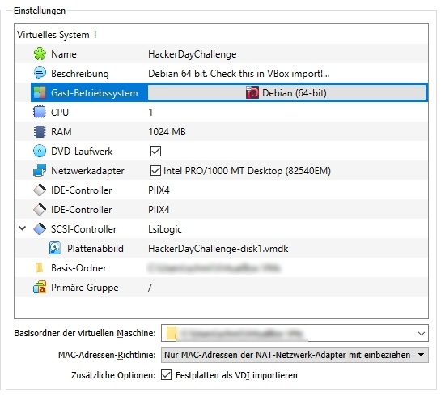
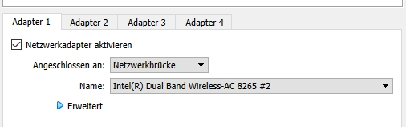
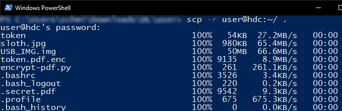

# usdhackerdays2019

2019 I took part in my first CTF, the "usd Hackers’ Days 2019", which was organized by the German IT company [usd](https://www.usd.de/). 
As it was my first CTF it was very challenging but interesting at the same time. In 04/2020 a [page](https://www.usd.de/en/usd-hackers-days-2019-challenge-now-live/) with some information is still online, but it is not possible anymore to download them. If you are interested in solving the challenges on your own contact me.

The overall goal was to find 6 flags in the scheme __usd{md5}__ in a linux image.

## 0. Setup:
usd provided a virtual machine (.ova), in which we had to find the the flags. After downloading the virtual machine, I used virtual box to import it. The notes state, that the OS is Debian 64bit, and it is important to select this during the import, as it wouldn't start otherwise. Additionally the notes contain the user login credentials: __user:resu__



Before starting the machine, I set the network adapter to bridged mode. This allows the machine with the name "hdc" to get a custom IP-address.



After booting the vm and logging in with the provided credentials, I found multiple interesting files in the home directory of user. Since one has no administrative rights in the vm, I checked the vms local ip with `ip a` and downloaded these files with ssh/scp to my main machine.
```console
scp -r user@hdc:~ /local/path
```


Apart from the default files (.bash_history, ...) there are four folders and one file: bin, Desktop, Documents, Pictures and .secret.pdf. Each of these hides a flag. The extraction of the sixth flag (thide), which is hidden in another spot, is explained in section 6.

 - Reversing\
 - File analysis\
 - Vulnerability in AES implementation\
 - File analysis + password cracking\
 - password cracking\
 - Reversing

Start reading with , a reversing challenge which was one of the hardest flags to find.


